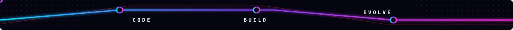

<!--
===============================================================================
CONFIGURACIÓN
===============================================================================
Reemplaza los marcadores de esta lista antes de publicar. Usa “Buscar y
reemplazar” en todo el archivo; algunos aparecen también dentro de URLs.

Identidad y contacto
- [NOMBRE]
- [ALIAS PROFESIONAL]                     (opcional; puede ser igual a tu nombre)
- [USUARIO_GITHUB]
- [CIUDAD, PAÍS]
- [CORREO PROFESIONAL]
- [LINKEDIN]
- [PORTAFOLIO]

Perfil y aprendizaje
- [TECNOLOGÍA QUE ESTOY APRENDIENDO]
- [TECNOLOGÍA EN APRENDIZAJE 2]
- [TIPO DE PROYECTOS QUE ME INTERESA CREAR]
- [INTERÉS PROFESIONAL]
- [META A CORTO PLAZO]
- [PRÓXIMO OBJETIVO DE APRENDIZAJE]

Stack (conserva únicamente tecnologías que realmente estés estudiando o usando)
- [LENGUAJE 1] / [LENGUAJE 2]
- [FRONTEND 1] / [FRONTEND 2]
- [BACKEND 1] / [BACKEND 2]
- [BASE DE DATOS 1] / [BASE DE DATOS 2]
- [HERRAMIENTA 1] / [HERRAMIENTA 2]

Proyectos
- [PROYECTO DESTACADO 1], [DESCRIPCIÓN PROYECTO 1], [TECNOLOGÍAS PROYECTO 1],
  [URL REPOSITORIO 1], [ESTADO PROYECTO 1]
- [PROYECTO DESTACADO 2], [DESCRIPCIÓN PROYECTO 2], [TECNOLOGÍAS PROYECTO 2],
  [URL REPOSITORIO 2], [ESTADO PROYECTO 2]
- [PROYECTO DESTACADO 3], [DESCRIPCIÓN PROYECTO 3], [TECNOLOGÍAS PROYECTO 3],
  [URL REPOSITORIO 3], [ESTADO PROYECTO 3]

Recursos
- El banner se reemplaza en assets/banner-cyberpunk.webp sin cambiar esta ruta.
- Los SVG de assets son originales y pueden editarse con cualquier editor de texto.
- La animación de contribuciones requiere .github/workflows/snake.yml.

Privacidad
- No publiques correo, ciudad o enlaces que no quieras hacer públicos.
- Si no tienes LinkedIn o portafolio, elimina su botón completo.

El próximo arco comienza con un nuevo commit.
===============================================================================
-->

<div align="center">
  
</div>

<h1 align="center">[NOMBRE] <span aria-hidden="true">⌁</span> Estudiante de ADSO</h1>

<p align="center">
  <a href="https://github.com/[USUARIO_GITHUB]">
    
  </a>
</p>

<p align="center">
  
  
</p>

> **Explorando • Aprendiendo • Programando • Evolucionando**

## `01 // PRESENTACIÓN`

Soy **[NOMBRE]**, estudiante de **ADSO — Análisis y Desarrollo de Software**. Estoy construyendo bases sólidas en programación mientras convierto ideas y ejercicios de aprendizaje en proyectos cada vez más completos.

Me interesa crear **[TIPO DE PROYECTOS QUE ME INTERESA CREAR]**. Mi objetivo es crecer con constancia, escribir mejor código y prepararme para aportar con responsabilidad en proyectos profesionales.



## `02 // SOBRE MÍ`

```yaml
perfil:
  nombre: "[NOMBRE]"
  alias: "[ALIAS PROFESIONAL]"
  ubicación: "[CIUDAD, PAÍS]"
  estado: "Desarrollador de software en formación"

trayectoria:
  formación_actual: "ADSO — Análisis y Desarrollo de Software"
  área_principal: "Programación y desarrollo de software"
  tecnología_en_aprendizaje: "[TECNOLOGÍA QUE ESTOY APRENDIENDO]"

radar_profesional:
  interés: "[INTERÉS PROFESIONAL]"
  meta_corto_plazo: "[META A CORTO PLAZO]"
  filosofía: "Aprender, construir, revisar y evolucionar"
```

<table>
  <tr>
    <td width="22%" align="center">
      
    </td>
    <td width="78%">
      <strong>Ruta actual</strong><br/>
      🧭 Formación: ADSO<br/>
      ◉ Práctica: proyectos y ejercicios de desarrollo<br/>
      ↗ Destino: [META A CORTO PLAZO]
    </td>
  </tr>
</table>

## `03 // STACK TECNOLÓGICO`

<!--
Los badges siguientes son marcadores, no afirmaciones de dominio.
Reemplaza el texto y, si quieres, añade &logo=nombre-del-icono a cada URL.
Elimina cualquier tecnología que no estés estudiando o utilizando.
-->

| Categoría | Tecnologías confirmadas por ti |
|---|---|
| **Lenguajes** |   |
| **Frontend** |   |
| **Backend** |   |
| **Bases de datos** |   |
| **Herramientas y control de versiones** |   |
| **En aprendizaje** |   |


## `04 // PROYECTOS DESTACADOS`

<!--
Cada fila representa una etapa de tu ruta. Sustituye todos los marcadores.
Cuando tengas una URL real, convierte el nombre usando una etiqueta <a>
con la URL y el nombre del proyecto correspondientes.
-->

<table>
  <thead>
    <tr>
      <th>Etapa</th>
      <th>Proyecto</th>
      <th>Descripción</th>
      <th>Tecnologías</th>
      <th>Estado</th>
    </tr>
  </thead>
  <tbody>
    <tr>
      <td><strong>RUTA 01</strong></td>
      <td>[PROYECTO DESTACADO 1]<br/><code>[URL REPOSITORIO 1]</code></td>
      <td>[DESCRIPCIÓN PROYECTO 1]</td>
      <td>[TECNOLOGÍAS PROYECTO 1]</td>
      <td>[ESTADO PROYECTO 1]</td>
    </tr>
    <tr>
      <td><strong>RUTA 02</strong></td>
      <td>[PROYECTO DESTACADO 2]<br/><code>[URL REPOSITORIO 2]</code></td>
      <td>[DESCRIPCIÓN PROYECTO 2]</td>
      <td>[TECNOLOGÍAS PROYECTO 2]</td>
      <td>[ESTADO PROYECTO 2]</td>
    </tr>
    <tr>
      <td><strong>RUTA 03</strong></td>
      <td>[PROYECTO DESTACADO 3]<br/><code>[URL REPOSITORIO 3]</code></td>
      <td>[DESCRIPCIÓN PROYECTO 3]</td>
      <td>[TECNOLOGÍAS PROYECTO 3]</td>
      <td>[ESTADO PROYECTO 3]</td>
    </tr>
  </tbody>
</table>

> Navegando entre código, ideas y nuevos desafíos.

## `05 // ACTIVIDAD Y ESTADÍSTICAS`

<!--
Reemplaza [USUARIO_GITHUB] en todas las URLs.
Las tarjetas públicas pueden tener límites temporales. Para máxima estabilidad,
puedes generar SVG estáticos con GitHub Actions en una segunda iteración.
Los lenguajes mostrados reflejan repositorios públicos; no equivalen a dominio.
-->

<div align="center">
  
  
</div>

<div align="center">
  
</div>

<div align="center">
  
</div>

<!--
Esta imagen aparecerá después de ejecutar .github/workflows/snake.yml.
Si prefieres no usar la animación, elimina el bloque picture completo.
-->

<picture>
  <source
    media="(prefers-color-scheme: dark)"
    srcset="https://raw.githubusercontent.com/[USUARIO_GITHUB]/[USUARIO_GITHUB]/output/github-contribution-grid-snake-dark.svg"
  />
  <source
    media="(prefers-color-scheme: light)"
    srcset="https://raw.githubusercontent.com/[USUARIO_GITHUB]/[USUARIO_GITHUB]/output/github-contribution-grid-snake.svg"
  />
  
</picture>

## `06 // ACTUALMENTE`

```javascript
const rutaActual = {
  estudiando: "ADSO — Análisis y Desarrollo de Software",
  construyendo: "[PROYECTO DESTACADO 1]",
  practicando: "[TECNOLOGÍA QUE ESTOY APRENDIENDO]",
  siguienteObjetivo: "[PRÓXIMO OBJETIVO DE APRENDIZAJE]",
  proceso: ["APRENDER", "CREAR", "REVISAR", "EVOLUCIONAR"]
};

console.log("La constancia también compila resultados.");
```

## `07 // CONECTA CONMIGO`

<!--
Elimina los botones cuyos datos no quieras publicar o todavía no tengas.
No dejes marcadores sin completar al publicar el perfil.
-->

<p align="center">
  <a href="https://github.com/[USUARIO_GITHUB]">
    
  </a>
  <a href="[LINKEDIN]">
    
  </a>
  <a href="mailto:[CORREO PROFESIONAL]">
    
  </a>
  <a href="[PORTAFOLIO]">
    
  </a>
</p>


<p align="center">
  <strong>Cada línea de código es una coordenada más en la ruta.</strong>
</p>

<p align="center">
  
</p>

<p align="center">
  Gracias por visitar mi perfil. <strong>CODE · BUILD · EVOLVE</strong>
</p>
